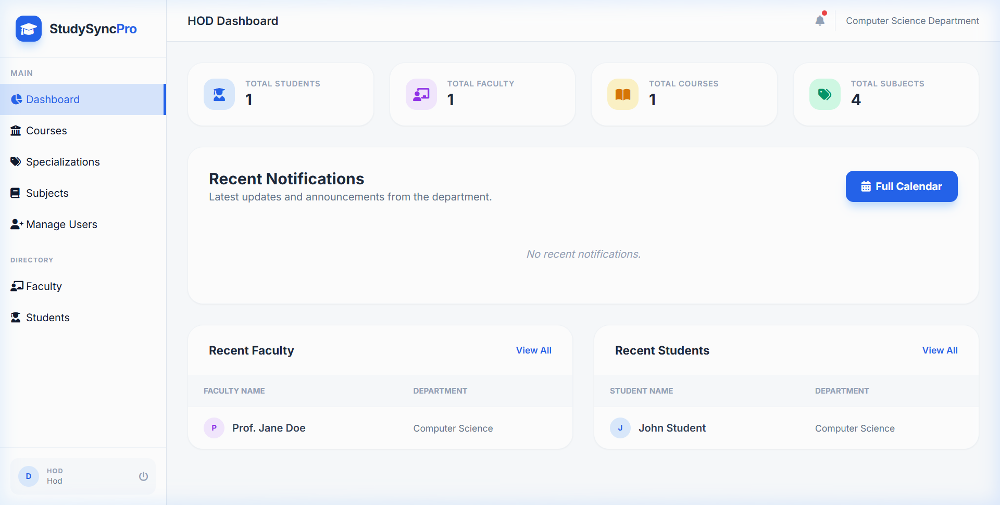
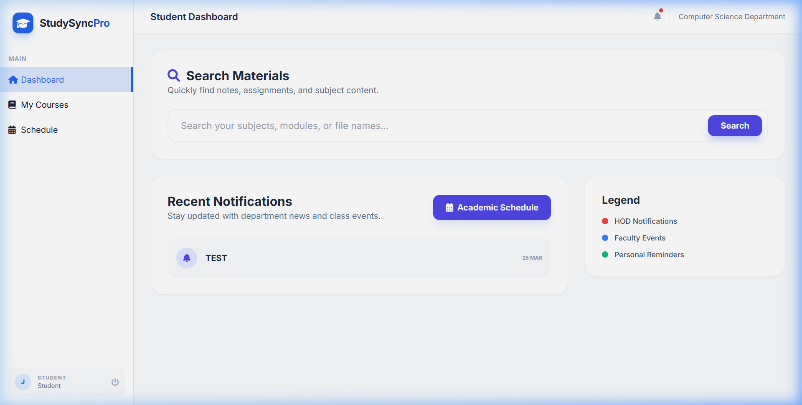
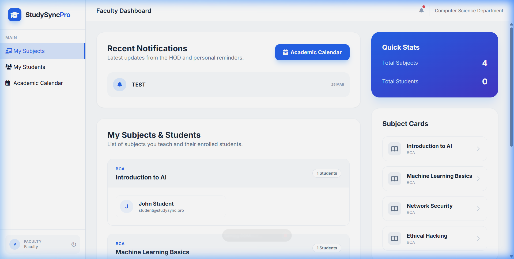
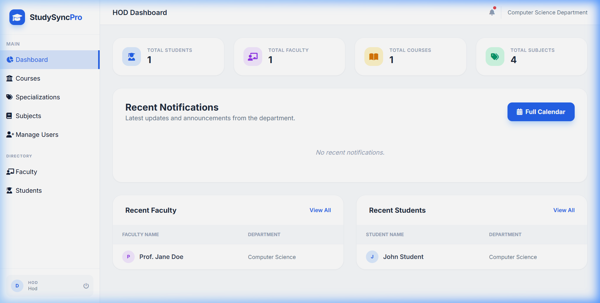

# StudySyncPro - Intelligent ERP for Higher Education

StudySyncPro is a modern, AI-powered ERP system designed for Colleges and Universities. It streamlines academic management, material distribution, and student-faculty interaction with integrated AI assistance.

## 🚀 Key Features

### 🖼️ System Preview

| Login Page | Student Dashboard |
| :--- | :--- |
|  |  |

| Faculty Dashboard | HOD Dashboard |
| :--- | :--- |
|  |  |

### 👤 Role-Based Dashboards
- **Student Dashboard**: Personalized view of enrolled subjects, notifications, and an interactive academic calendar.
- **Faculty Dashboard**: Tools for managing subjects, uploading materials, and tracking student enrollment.
- **HOD Dashboard**: Departmental oversight, course management, and faculty/student directories.

### 🤖 AI-Powered Suite
- **AI Sequential Search**: A global intelligent search bar that understands natural language queries to find study materials across all modules and subjects.
- **Module-Scoped RAG Chatbot**: A real-time assistant inside every course module that answers questions based strictly on the uploaded materials (PDF, DOCX, TXT).
- **OpenRouter Integration**: Powered by `Mixtral-8x7B` for expert-level academic guidance.

### 📂 Smart Content Management
- **Hierarchical Organization**: Course → Specialization → Subject → Module → Unit → File.
- **Advanced Search**: Global search of all materials with multi-level indexing.
- **Inline Viewer**: Preview academic documents directly in the browser.

### 📅 Academic Schedule
- Unified calendar for events, deadlines, and personal reminders.

## 🛠️ Technology Stack
- **Backend**: Flask (Python), SQLAlchemy (ORM), Flask-Login.
- **Database**: SQLite (Production-ready relational schema).
- **AI/ML**: `sentence-transformers` (Local Embeddings), `pypdf`, `python-docx`.
- **UI/UX**: Tailwind CSS, FontAwesome, FullCalendar.

## ⚙️ Installation & Setup

1. **Clone the repository**:
   ```bash
   git clone https://github.com/Leviiiz18/PROJ--StudySyncPro.git
   cd PROJ--StudySyncPro
   ```

2. **Install dependencies**:
   ```bash
   pip install -r requirements.txt
   ```

3. **Configure Environment Variables**:
   Create a `.env` file or set:
   ```bash
   export SECRET_KEY='your-secret-key'
   export OPENROUTER_API_KEY='your-api-key'
   ```

4. **Initialize Database**:
   ```bash
   python db_init.py
   python seeds.py
   python process_documents.py
   ```

5. **Run the application**:
   ```bash
   python app.py
   ```

## 🔐 Demo Credentials

Access the system using these pre-seeded accounts:

| Role | Email | Password |
| :--- | :--- | :--- |
| **HOD** | `hod@studysync.pro` | `admin123` |
| **Faculty** | `faculty@studysync.pro` | `password123` |
| **Student** | `student@studysync.pro` | `password123` |

## 📄 Documentation
- [Academic Structure](academic_structure.txt)

---

